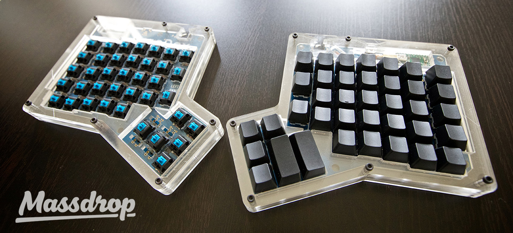
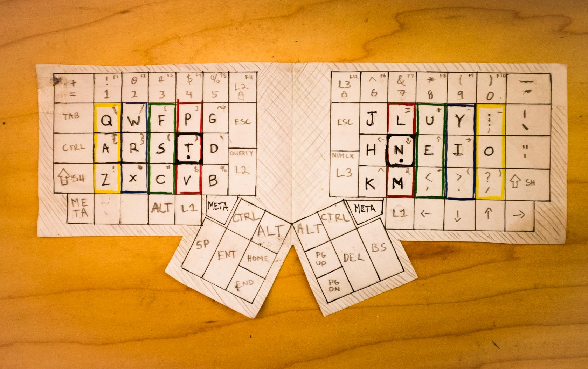
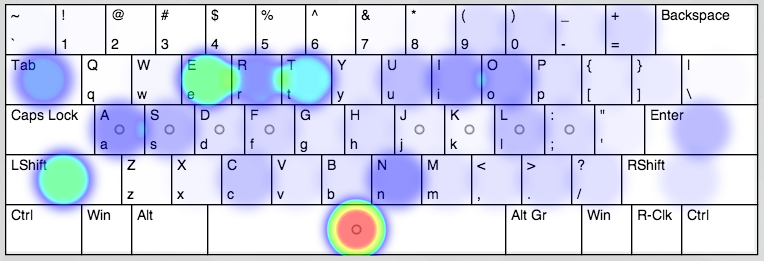
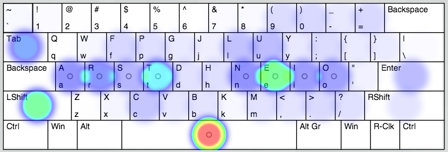
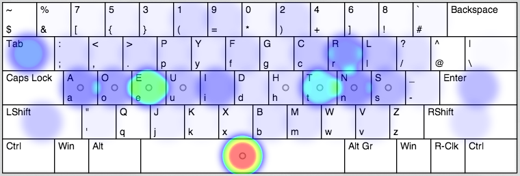
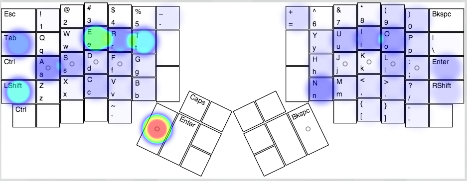
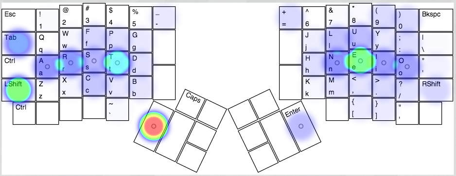
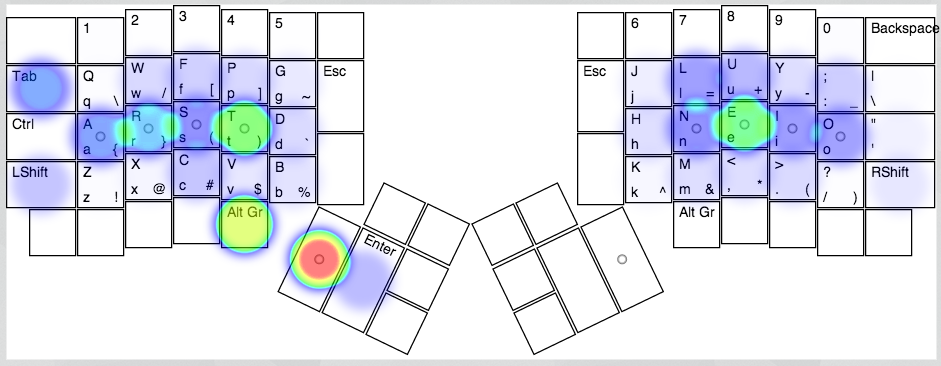
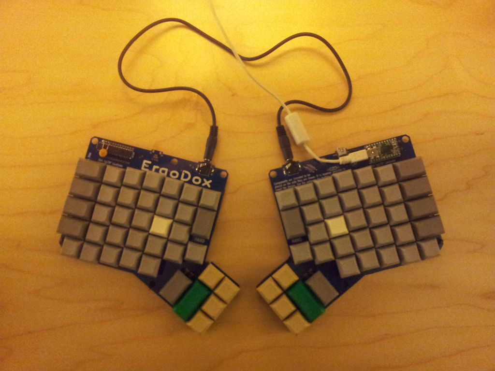
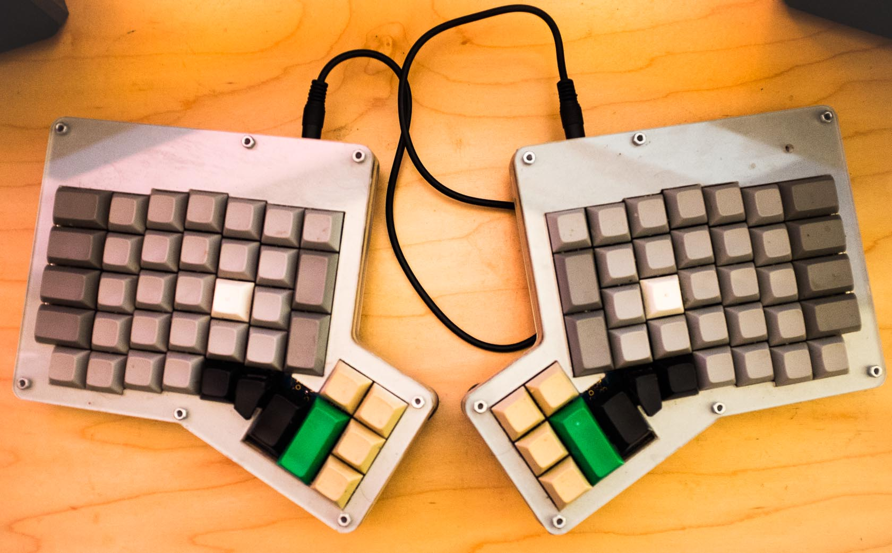

The [ErgoDox][] is a split-hand ergonomic keyboard with mechanical switches and open source, layer-based firmware running on a [Teensy][] microcontroller. While other keyboards offer [dip-switches][codekeyboard] or GUI config tools, the firmware and layouts can be [built from source][0] on the command line or through a [layout configuration tool][]. Flashing a new build onto the ErgoDox is easy with the multi-platform [Teensy loader][]. And the hardware side is equally hackable, as [these][3] [examples][4] [show][5].

What this all adds up to is a *highly configurable keyboard* that can be tailored to fit your *exact* needs.

Because of this flexibility, I was able to [program my own Colemak layout][mylayout] that adds a layer for common programming symbols on and near the home row, while enjoying a more ergonomic experience by allowing me to separate, rotate, and pitch the keyboard halves as needed. This has all resulted in an improved typing experience - not necessarily an increase in WPM, but a reduction of finger movement and an increase in comfort.

If you're not familiar with the concept of keyboard layers, don't fret; you switch between different layers likely hundreds of times an hour. A layer is simply a map from physical keys to characters. Switching between layers is often triggered by holding down a meta key, like shift. The shift key switches the keyboard from its "default" layer to the "uppercase" layer, which causes certain keys to output different characters (ex. "a" becomes "A", "3" becomes "#").

The ErgoDox firmware abstracts this idea to an arbitrary number of user-defined layers that can be triggered and toggled by any key. This is great for us developers, as we can fine tune our layouts to let our fingers be <del>lazy</del> efficient.

## On <del>laziness</del> efficiency

Take a look at the heat maps generated if we were to type out [Underscore 1.5.2](/assets/bower_components/underscore/underscore.js) with QWERTY, Colemak, Programmer Dvorak, ErgoDox QWERTY, ErgoDox Colemak and my custom ErgoDox Colemak layout:

<em><small>Note: an earlier version of this article had the space key over-represented due to Underscore (rightly!) using spaces instead of tabs. Jus' kiddin about the rightly. Well, not really, but this isn't the place for a holy war.</small></em>
  

###QWERTY

###Colemak

###Programmer Dvorak

###ErgoDox QWERTY

###ErgoDox Colemak

###ErgoDox Colemak JJT

<em><small>Note: the "alt gr" keys are really my function layer keys, and that it doesn't take into account utilizing the right hand function layer key. If a symbol is on the left side I use the right fn key, and vice versa.</small></em>

These were generated by the [Keyboard Layout Analyzer](http://patorjk.com/keyboard-layout-analyzer/#/load/ZQSRk2KR), which is a fantastic tool by [@patorjk](https://twitter.com/patorjk). It's not perfectly accurate for capturing the actual coding experience, as it ignores things like modal editors, snippets/macros, backspaces, code completion, etc. but it's useful for broad comparison.

You'll notice immediately how much distance the pinkies save from the ErgoDox putting the enter key on the thumbs (1,275 strokes) along with the symbol layer keeping the fingers near the home row, avoiding the huge cluster of `[]{}|\=+-_()` (~2,700 strokes), more than half of which need the left pinky to shift. Programmer Dvorak is much better in this regard with its preference for symbols over digits, which is a wise move given that it's a 10:1 ratio, respectively. Still, I prefer not having to reach for the number row, or for the backspace key (whoopsies happen!).

Having these common programming symbols under the home row means that my fingers stay in position more frequently, saving strain on the weaker pinkies while offloading and generating more work for the robust thumbs. Using the fn layers for symbols requires ~2,000 additional strokes on the thumbs over QWERTY, but also means that we save ~1,900 pinky shift strokes.

Since I switched from a standard QWERTY keyboard to an ErgoDox with a custom layout at the same time, it's tough to say how much the physical keyboard format, Colemak layout, and the symbol layer each contribute to the improvement I've noticed. But I'd wager that it's pretty evenly split, and I would recommend integrating at least the fn layer, if not the 'Dox and/or Colemak layouts.

The really great thing about building your firmware from source is that you can iterate very easily using familiar workflows (edit, compile, deploy; lather, rinse, repeat). For example, while I was analyzing the heatmaps for this article I started thinking about how I probably use the fn layer keys more than GUI (Win/Command), and I should switch them. I'm also thinking about swapping the delete thumb key and the right shift key. Obviously the source code can't contain the number of delete keypresses, but I'm just guessing that I use shift more than delete. With most keyboards, you just wouldn't be able to entertain ideas like this, let alone execute on them in minutes or less.

<em><small>Update: my thumbs violently rejected the GUI/fn layer switch, attemping to quit macvim half a dozen times. I'm sure I could retrain them, but it seems like such a small gain.</small></em>

## Where we're at, where we've been

The ErgoDox was developed over the course of a couple years on [Deskthority][] and [geekhack][] by Dox, with help from other users. I managed to snag one of the last prototype boards and assembled the parts myself. Since it would have been expensive to produce a one-off case due in part to its [intricate plate layer][10], I opted for board-mount switches instead and just sat the PCBs right on fun foam. It worked very well - the foam distributed the weight along the PCB while letting the solder tails sink in.

I've since got a proper case from the defacto supplier, [Massdrop][]. They're a site that facilitates group buys from manufacturers to save users money. They have a registration wall so they can be classified as something other than a retailer - annoying, I know, but necessary.

## Massdrop to the rescue!

The project stalled somewhat after the prototype stage, as no forum member wanted to step up to arrange payment handling and logistics for a couple hundred orders and $50,000+ worth of parts. After a while and much heated discussion, Massdrop was decided upon for logistics and now periodically offers the ErgoDox as a kit with a beautiful CNC-cut acrylic or aluminum case. They've also put together [very detailed assembly instructions][20] and made the previously-mentioned [layout configuration tool][].

## Love me, love my ErgoDox

Or: I'll give you my ErgoDox when you pry it from my cold, dead hands. I will take this wherever I need to code, or buy multiple copies of it if transport isn't viable. 

This is my first mechanical keyboard after many happy years with [Thinkpad travel keyboards][2] and I've been enjoying the satisfying feel of the switches' tactile bump at the actuation point. I went with Cherry MX browns, which are very quiet at the point of actuation. They will click from the keys bottoming out and from releasing the key, however, but I think most non-chiclet keyboards will do so.

[The current sale](https://www.massdrop.com/buy/ergodox) has one day left at time of writing, and seems to go on every couple of months. For $240 (with keycaps), it's a hell of keyboard.

*Anti-disclaimer: I have no affiliation with Massdrop, other than as a satisfied repeat customer* 

[ErgoDox]: http://ergodox.org/
[Teensy]: http://www.pjrc.com/teensy/
[geekhack]: http://geekhack.org/
[Deskthority]: http://deskthority.net/
[layout configuration tool]: https://www.massdrop.com/ext/ergodox
[Teensy loader]: http://www.pjrc.com/teensy/loader.html
[codekeyboard]: http://codekeyboards.com/
[mylayout]: https://github.com/jjt/ergodox-firmware/blob/master/src/keyboard/ergodox/layout/colemak-symbol-mod.c
[Massdrop]: https://massdrop.com

[0]: https://github.com/benblazak/ergodox-firmware
[2]: http://www.ideacouture.com/blog/wp-content/uploads/2009/09/thinkpad-keyboard-beauty-1024x402.jpg
[3]: http://geekhack.org/index.php?topic=43709.0
[4]: http://farm4.staticflickr.com/3833/8943930400_c2e1f0b47e_z.jpg
[5]: http://geekhack.org/index.php?topic=46860.msg996709#msg996709
[6]: http://www.kinesis-ergo.com/images/cont-above-hands-blk630x390.jpg

[10]: http://i.imgur.com/cw4nX0w.png
[20]: https://www.massdrop.com/ext/ergodox/assembly